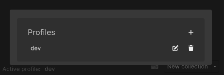

Profiles in ASM can be used to quickly switch between different configurations and scene setups.

Profiles contains:
* Collections
* Dynamic collections
* Standalone scenes
* Default loading screen
* Splash screen
* Various configuration settings found in settings popup

The available profiles can be viewed, selected and created in the profile picker, in the bottom left of the [scene manager window](Scene%20manager%20window.md).

Profiles can be forced for other team-members, see more [here](Scene%20manager%20window.md#editor-page).
