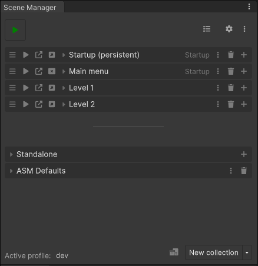
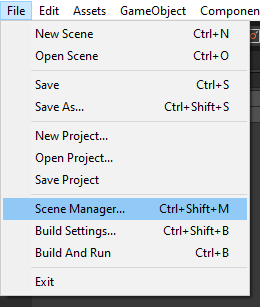
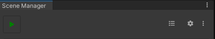
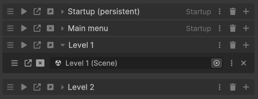
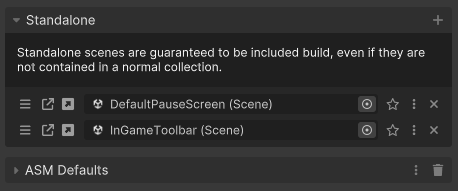
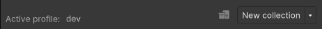

The scene manager window is the front-end for ASM. It can be used to manage collections, scenes, and behavior of ASM.

The scene manager window can be opened through:\

# Main view
### Header

The header contains the following, in order, left to right:
* Play button, enters play mode and runs startup process, as if we're running in a build.
* Overview button, opens a popup presenting all scenes in project.
* Settings button, displays settings popup.
* Menu button, displays a menu with some useful tools.

### Collections and scenes

The collections and scene list contains exactly that, your collections, and their scenes.

#### Collection header
The elements in the collection header are as follows, in order, left to right:
* Reorder collections.
* Enter play mode and open collection when startup process done *(startup process when using this button can be turned off in settings)*.
* Open collection.
* Open / close collection as additive.
* Collection title
* Collection menu button, opens a popup containing settings for the given collection.
* Remove button, removes the collection.
* Add scene field button.

> Note that some elements may be hidden, check settings for more.

#### Scene field
The elements on the scene field are as follows, in order, left to right:
* Reorder scenes.
* Open scene.
* Open / close scene as additive.
* Scene selector (could also be called scene field, conflicting terms here).
* Indicators *(not visible in image above)*.
* Scene menu button, opens a popup containing settings for the scene, some global, some specific to parent collection.
* Delete button, deletes the scene field.

> Note the terms *Remove* and *Delete*, Remove is used to describe a reversible action here, whereas delete will not provide option to undo.

### Dynamic collections and scenes

Dynamic collections are collections that contain scenes that do not fit within a normal collection, but are still supposed to be included in build. This is needed because ASM manages the build scene list (adding a scene to list manually just causes ASM to add it to standalone collection).

The **standalone** is a special dynamic collection, it allows you to add scene fields and modify its scene list, it also cannot be deleted. 

The **ASM Defaults** dynamic collection on the other hand is a normal dynamic collection, it takes a path to a folder, and gathers all scenes found within its subfolders. The folder path can be configured in the collection popup.

> The stars in the image above are persistent indicators, these scenes will not be closed automatically by ASM, only when user requests it *(or by scene bindings in this case, see scene popup for more information)*.

### Footer

The footer contains, in order, left to right:
* Profile selector, opens a popup where a profile can be selected, or created.
* Scene helper button, provides an easy way to gain a drag drop reference to scene helper scriptable object, which can be used in UI button click, for example.
* New collection split button, pressing dropdown section opens a popup where you can create a dynamic collection, or create normal collection from a template.

# Collection popup
*Coming soon*
# Scene popup
*Coming soon*
# Menu popup
*Coming soon*
# Settings popup
*Coming soon*

