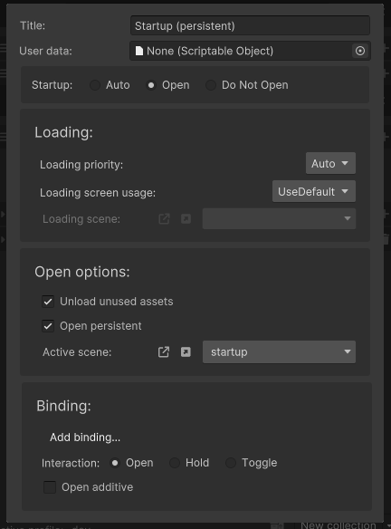
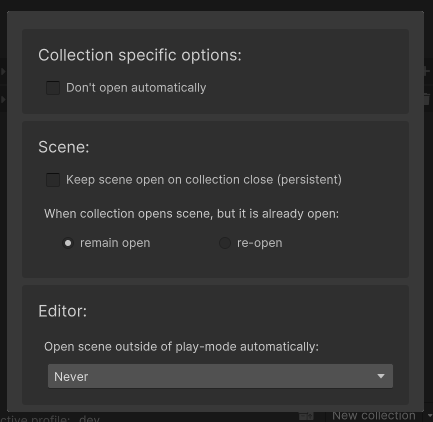
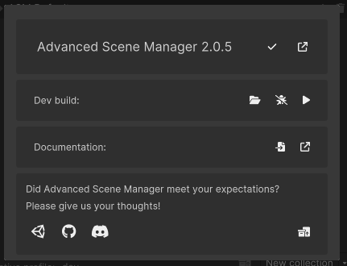

The scene manager window is the front-end for ASM. It can be used to manage collections, scenes, and behavior of ASM.

The scene manager window can be opened through:\

# Main view
### Header

The header contains the following, in order, left to right:
* Play button, enters play mode and runs startup process, as if we're running in a build.
* Overview button, opens a popup presenting all scenes in project.
* Settings button, displays settings popup.
* Menu button, displays a menu with some useful tools.

### Collections and scenes

The collections and scene list contain... collections and scenes!.

#### Collection header
The elements in the collection header are as follows, in order, left to right:
* Reorder collections.
* Enter play mode and open collection when startup process done *(startup process when using this button can be turned off in settings)*.
* Open collection.
* Open / close collection as additive.
* Collection title
* Collection menu button, opens a popup containing settings for the given collection.
* Remove button, removes the collection.
* Add scene field button.

> Note that some elements may be hidden, check settings for more.

#### Scene field
The elements on the scene field are as follows, in order, left to right:
* Reorder scenes.
* Open scene.
* Open / close scene as additive.
* Scene selector (could also be called scene field, conflicting terms here).
* Indicators *(not visible in image above)*.
* Scene menu button, opens a popup containing settings for the scene, some global, some specific to parent collection.
* Delete button, deletes the scene field.

> Note the terms *Remove* and *Delete*, Remove is used to describe a reversible action here, whereas delete will not provide option to undo.

> Collection headers and scenes may be dragged to gain a drag drop reference.

### Dynamic collections and scenes

Dynamic collections are collections that contain scenes that do not fit within a normal collection, but are still supposed to be included in build. This is needed because ASM manages the build scene list (adding a scene to list manually just causes ASM to add it to standalone collection).

The **standalone** is a special dynamic collection, it allows you to add scene fields and modify its scene list, it also cannot be deleted. 

The **ASM Defaults** dynamic collection on the other hand is a normal dynamic collection, it takes a path to a folder, and gathers all scenes found within its subfolders. The folder path can be configured in the collection popup.

> The stars in the image above are persistent indicators, these scenes will not be closed automatically by ASM, only when user requests it *(or by scene bindings in this case, see scene popup for more information)*.

### Footer

The footer contains, in order, left to right:
* Profile selector, opens a popup where a profile can be selected, or created.
* Scene helper button, provides an easy way to gain a drag drop reference to scene helper scriptable object, which can be used in UI button click, for example.
* New collection split button, pressing dropdown section opens a popup where you can create a dynamic collection, or create normal collection from a template.

# Collection popup

The collection popup contains:
* **Title**
* **User data**, which can be used to associate custom scriptable object with collection, retrievable by `SceneCollection.UserData<T>()` or `SceneCollection.UserData()`. They can implement scene callbacks as well.
* **Startup**, determines if collection should be opened by ASM during startup. Auto means ASM will open collection if it is first collection in list, and and no other collection is specified as *open*.
* **Loading priority**, when not set to *auto*, ASM will automatically set corresponding [ThreadPriority](https://docs.unity3d.com/ScriptReference/ThreadPriority.html) when scene operation begins, on collection open / close, and then reset it when done.
* **Loading screen usage**, determines if default loading screen should be used, or if it should be overridden, or disabled.
* **Loading scene**, determines loading scene to use when above is set to override.
* **Unload unused assets**, if true then ASM will automatically call [Resources.UnloadUnusedAssets](https://docs.unity3d.com/ScriptReference/Resources.html) when scene operation, on collection open / close, is done.
* **Open persistent**, determines if all scenes within should be opened as persistent.
* **Active scene**, specifies scene to activate when opening collection.
* **Binding**, specifies a input binding that can be used to open collection when pressed *(only available when [InputSystem](https://docs.unity3d.com/Packages/com.unity.inputsystem@1.7/manual/index.html) is installed)*.
* **Interaction**, specifies whatever binding will automatically close collection.
	* **Open**, do not close, only open.
	* **Hold**, close collection when binding is released.
	* **Toggle**, close collection on next press.
* **Open additive**, opens the collection as additive when using binding.

# Scene popup

The scene popup contains:
* **Do not open automatically**, specifies whatever this scene should remain closed when collection is opened, use this when you want to open scene yourself, but still want scene associated with collection. *This is a collection specific setting, and is saved on parent collection.*
* **Keep scene open on collection close (persistent)**, specifies that this scene should not be closed by ASM automatically, only when user explicitly closes scene directly.
* **When collection opens scene, but it is already open**, specifies what ASM should do when scene is already open when a collection opens it.
* **Open scene outside of play-mode automatically**, specifies that ASM should open this scene additively, *outside of play-mode*, when another scene opens.

> *Collection specific options* section contains settings that are related to the current parent collection only, when assigning scene to multiple collections, this section will be different depending on collection. **All other sections are global.**
# Menu popup

The menu popup contains:
* **Current version**, version check and link to view available patches *(patches are .UnityPackage(s) that we provide outside of the normal unity asset store updates, that fixes bugs, and even sometimes provide new features, but could potentially be unstable, we try our hardest though!)*.
* **Dev build**, provides a quick way to build your project during development. Folder can be specified using folder button, and profiler can be attached using bug button. Press play button to build and run.
* **Documentation**, provides shortcuts to local docs, and online docs.
* **Contact**, ASM appreciates your feedback, bug reports and suggestions alike! Also contains a button to view example projects.
# Settings popup
*Coming soon*

