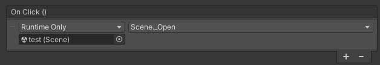
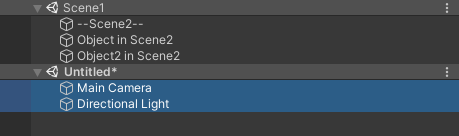

# Scenes

Scenes in ASM are represented as [ScriptableObject](https://docs.unity3d.com/Manual/class-ScriptableObject.html), this is to provide a simple drag drop interface for scenes.

## Drag-and-drop can be used for the following scenarios:
### Add scene to a collection, or replace existing scene field.


### UnityEvent

[Button](https://docs.unity3d.com/Packages/com.unity.ugui@1.0/manual/script-Button.html) On Click () handler for example:


### Scripts:

  ```csharp
  using AdvancedSceneManager.Models;
  
  public class OpenScene
  {
	
	public Scene scene;

	public void Open()
	{
		scene.Open();
	}

  }
  ```

## Importing

Scenes must be imported to be used in ASM. You can do so by pressing the notification in the scene manager window.


Scenes can be unchecked to not import them at this time.


Scenes may be blacklisted so they don't show up. Blacklisting a folder will result in all scenes inside the folder, including subfolders, will also be ignored.


Finally, just press import, and the imported scenes will now be usable in ASM.

Blacklist can be configured in [settings](Scene%20manager%20window.md#assets-page).
## Persistent scenes

Persistent scenes are scenes that do not automatically close when a collection is closed. This can be specified in the [scene popup](Scene%20manager%20window.md#scene-popup).
## Preloading

A scene can be preloaded by calling `Scene.Preload()`, or by using [scene helper](Scene%20helper.md). Only one scene may be preloaded at a time, and no other scene operations can occur while one is, *this is a unity limitation*.

```csharp
using AdvancedSceneManager.Models;
using UnityEngine;

public class PreloadTrigger : MonoBehaviour
{

    public Scene sceneToPreload;

    void OnTriggerEnter(Collider other)
    {
        if (!sceneToPreload.isOpen && !sceneToPreload.isPreloaded)
            sceneToPreload.Preload();
    }

    void OnTriggerExit(Collider other)
    {
        //User exited trigger, and since FinishPreload() has
        //not been called if .isPreloaded is true, that means
        //the user went backwards
        if (sceneToPreload.isPreloaded)
            sceneToPreload.DiscardPreload();
    }

    //Called from other, overlapping, trigger
    public void FinishPreload()
    {
        if (sceneToPreload.isPreloaded)
            sceneToPreload.FinishPreload();
    }

}
```

The currently preloaded scene can be retrieved statically by:\
`AdvancedSceneManager.SceneManager.preloadedScene;`
## Scene merging

Scenes can be merged by ctrl selecting two or more scenes in the [scene manager window](Scene%20manager%20window.md), and right clicking, then selecting 'merge scenes...'.


Scenes can be merged programmatically as well:\
*Only usable in editor*\
`SceneUtility.MergeScenes(targetScene, sceneToMergeIntoTargetScene); //Can accept multiple scenes in second argument`

## Scene splitting

Scenes can be split up into multiple by selecting two or more [GameObjects](https://docs.unity3d.com/Manual/class-GameObject.html) in the hierarchy.




Scenes can be split up programmatically as well:\
*Only usable in editor*\
`SceneUtility.MoveToNewScene(gameObject); //Moves current game object into a new scene, method supports multiple objects`
