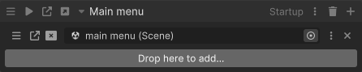
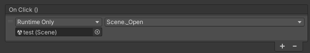
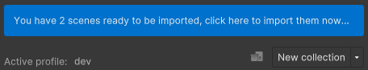
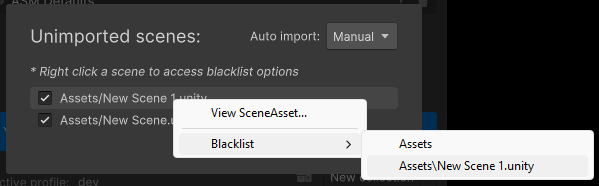

Scenes in ASM are represented as [ScriptableObject](https://docs.unity3d.com/Manual/class-ScriptableObject.html), this is to provide a simple drag drop interface for scenes.

Drag-and-drop can be used for the following scenarios:
##### Add scene to a collection, or replace existing scene field.


##### UnityEvent

[Button](https://docs.unity3d.com/Packages/com.unity.ugui@1.0/manual/script-Button.html) On Click () handler for example:


##### Scripts:

  ```csharp
  using AdvancedSceneManager.Models;
  
  public class OpenScene
  {
	
	public Scene scene;

	public void Open()
	{
		scene.Open();
	}

  }
  ```

### Importing

Scenes must be imported to be used in ASM. You can do so by pressing the notification in the scene manager window.



Scenes can be unchecked to not import them at this time.


Scenes may be blacklisted so they don't show up. Blacklisting a folder will result in all scenes inside the folder, including subfolders, will also be ignored.



Finally, just press import, and the imported scenes will now be usable in ASM.

Blacklist can be configured in [settings](Scene%20manager%20window.md#assets-page).
## Persistent scenes
WIP

### Preloading
WIP

### Scene merging
WIP

### Scene splitting
WIP