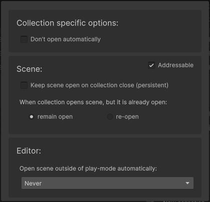

# Addressables

When [addressables](https://docs.unity3d.com/Manual/com.unity.addressables.html) package is installed, ASM will automatically switch to using the addressables API for opening and closing scenes for scenes specified as addressable. Scenes can be flagged as addressable in the [scene popup](Scene%20manager%20window.md#scene-popup), both collection scenes and standalone scenes can be flagged.

[Collection popup](Scene%20manager%20window.md#collection-popup) also has a toggle, which will toggle all scenes within.

> When ASM adds a [scene](Scenes.md) to addressables, it will add it under a default group, named after the [collection](Scene%20collections.md) the [scene](Scenes.md) is contained in. This group will not have a schema assigned to it by ASM, and is expected to be assigned manually, or have all scenes reassigned to other groups.

